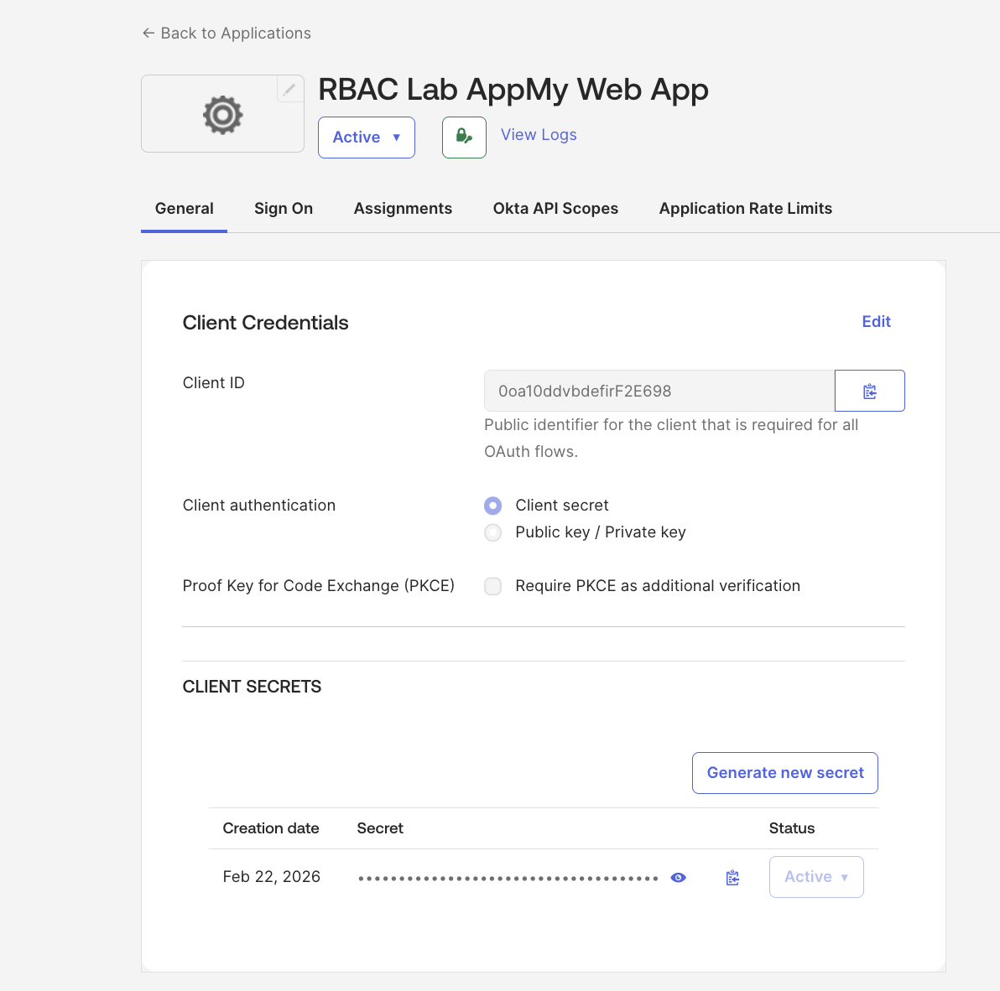
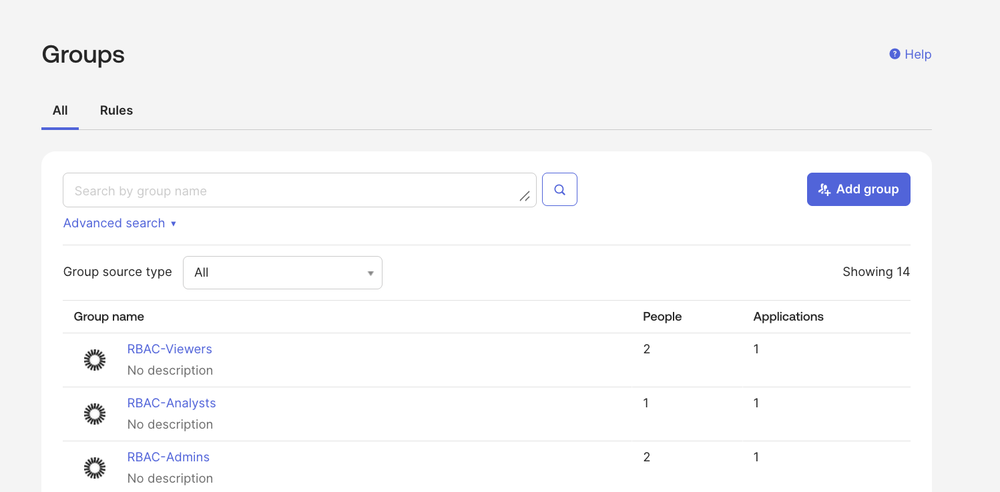
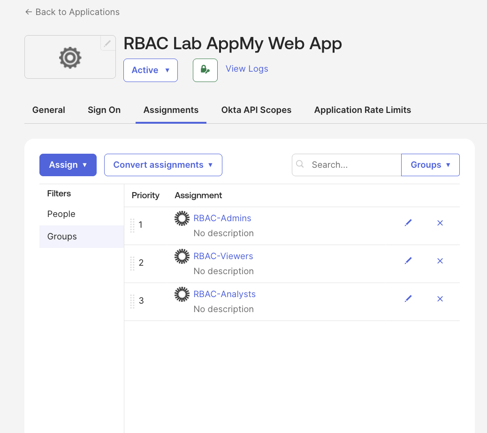
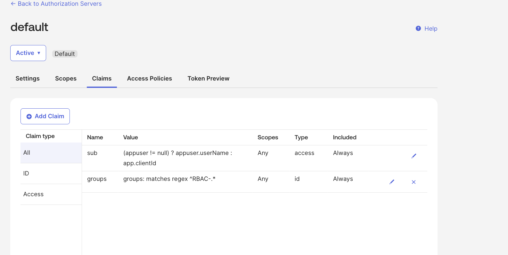
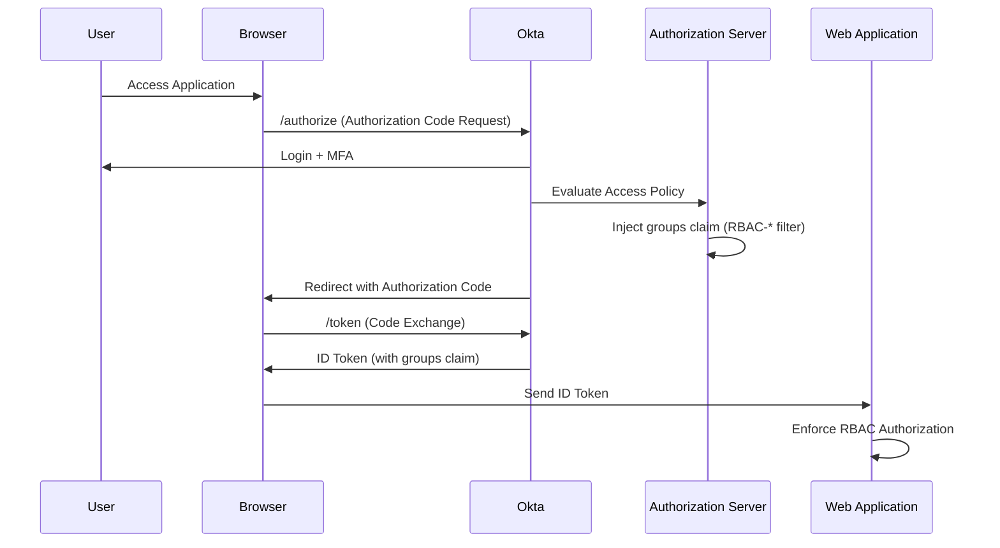
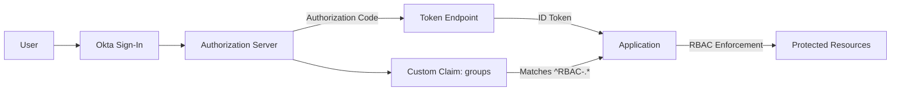

## 🛡️ Okta OIDC RBAC Authorization Lab

## 📘 Extended Technical Write-Up

🔗 [View Full Technical Breakdown in Notion](https://reliable-bougon-dc6.notion.site/OIDC-Authorization-Code-Flow-with-RBAC-Based-Token-Claims-310bb6ca18768028901aeae7cbacdf29?source=copy_link)

## 🔐 Role-Based Access Control (RBAC) with OIDC & Custom Claims

This lab demonstrates how to implement group-based authorization using:

Okta OIDC (Authorization Code Flow)

Custom ID Token claims

Authorization Server configuration

Group-to-role mapping

JWT validation

The goal was to dynamically inject RBAC group membership into an ID token and validate access logic based on that claim.

## 🧠 Architecture Overview

User authenticates via Okta (Authorization Code Flow)

Okta issues ID Token

Custom groups claim is injected

Application reads group claim

Authorization logic is enforced based on group membership

## 🏗️ Step 1 — Create OIDC Application

Configured a Web Application using:

Grant Type: Authorization Code

Client Authentication: Client Secret

Redirect URI: http://localhost:8080/authorization-code/callback

📸 OIDC App Configuration



## 👥 Step 2 — Create RBAC Groups

Created three role groups:

RBAC-Admins

RBAC-Analysts

RBAC-Viewers

Users were assigned based on role.

📸 RBAC Groups Created



## 🎯 Step 3 — Assign Groups to Application

Each RBAC group was assigned to the OIDC app under Assignments → Groups.

This ensures group membership can be evaluated during token issuance.

📸 Application Group Assignments



## 🧾 Step 4 — Configure Custom Groups Claim

Configured a custom claim in the Authorization Server:

Name: groups

Token Type: ID Token

Value Type: Groups

Filter: Matches regex ^RBAC-.*

Included in: Any scope

This dynamically injects only RBAC-related groups into the ID token.

📸 Custom Claim Configuration



## 🔄 Step 5 — Authorization Code Flow

Executed Authorization Code Flow:

/oauth2/default/v1/authorize

Scopes requested:

openid profile email groups

Returned authorization code was exchanged for ID Token.

## 🔍 Step 6 — Token Validation

Using Okta Token Preview and JWT decoding, verified the ID token contains the RBAC group claim.

📸 Token Preview


## 🧾 Example Token Payload (Redacted)

```json
{
  "sub": "00u…697",
  "email": "user@example.com",
  "preferred_username": "user@example.com",
  "groups": ["RBAC-Viewers"]
}
```

✅ Validation Results

✔ Authorization Code flow working
✔ ID Token successfully issued
✔ Custom groups claim injected
✔ RBAC group value matches expected user role
✔ Regex filter correctly limits claim output

## 🛡️ Security Concepts Demonstrated

OAuth 2.0 Authorization Code Flow

OpenID Connect ID Tokens

Custom Claims

Role-Based Access Control

JWT structure & validation

Group filtering via regex

Access Policy rule configuration

## 📈 Why This Matters

This lab simulates real-world identity architecture patterns used in:

SaaS RBAC enforcement

Enterprise SSO

API Authorization

Zero Trust access design

It demonstrates the difference between:

Authentication (who you are)

Authorization (what you’re allowed to do)

## 🧩 Next Enhancements

Map RBAC groups to API scopes

Enforce authorization in backend logic

Implement Access Token validation

Add policy rule restrictions per role

Build sample protected API

## 🏗️ Architecture Diagram

## 🔄 OIDC Authorization Code Flow with RBAC Claim Injection


## 🧠 Logical Component View



👩‍💻 Author

Brianna Wandt
Security Engineering | Identity & Access Management
